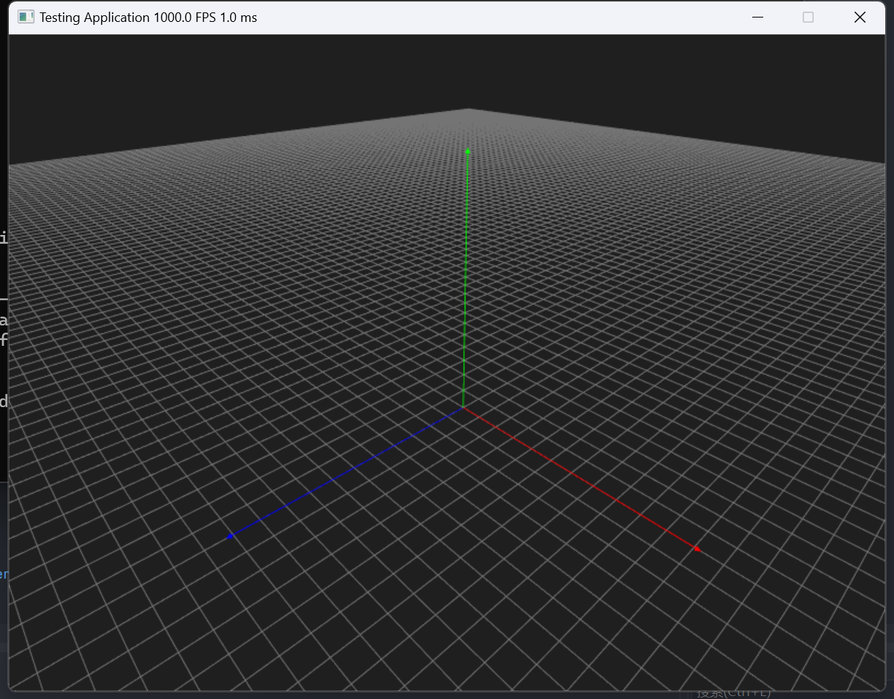

# Magnum Renderer

Magnum Renderer 是一个基于 Magnum 实现的一个用于绘制物件的 Renderer 应用程序

## 环境配置

### 步骤 1：下载并安装 vcpkg

在命令行中执行以下命令：

```bash
git clone https://github.com/microsoft/vcpkg.git
git submodule update --init --recursive
git submodule update --recursive --remote
```

### 步骤 2：安装 Magnum

在命令行中执行以下命令：

```bash
vcpkg install Magnum
```

## 运行结果


